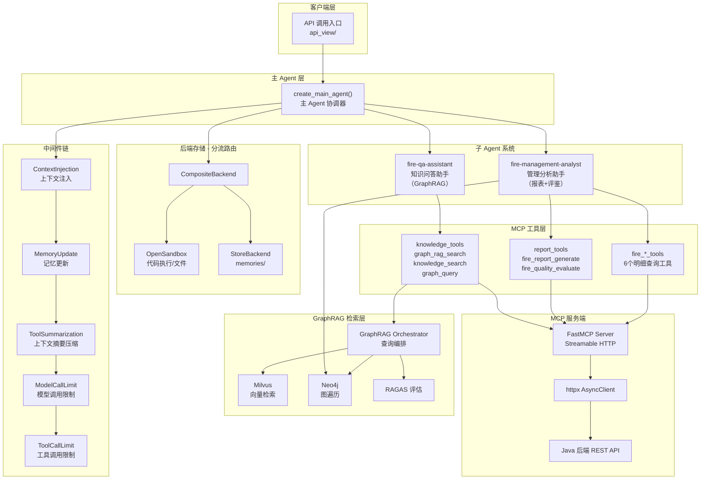
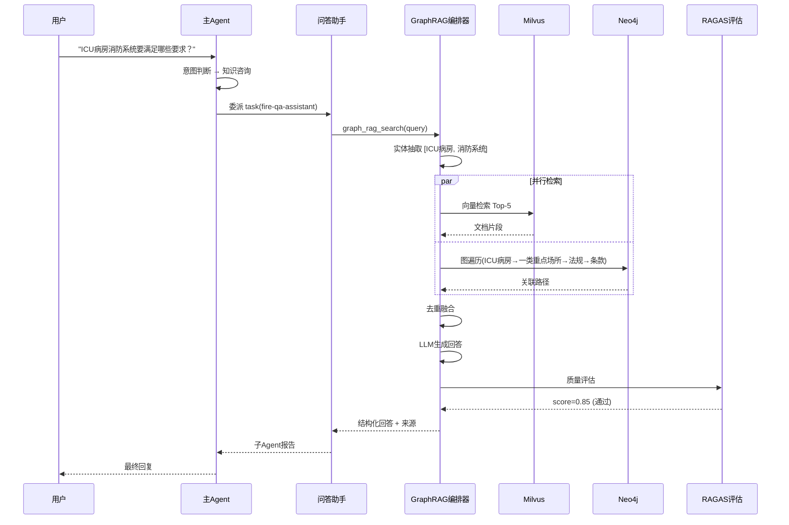
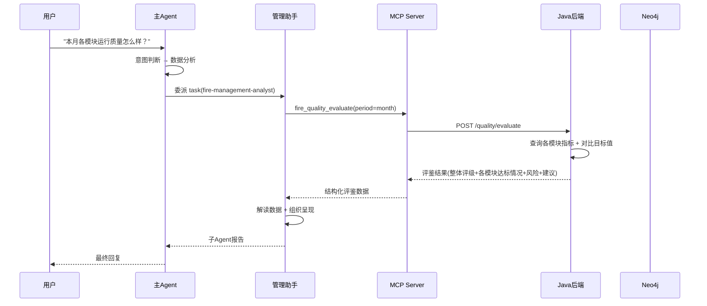
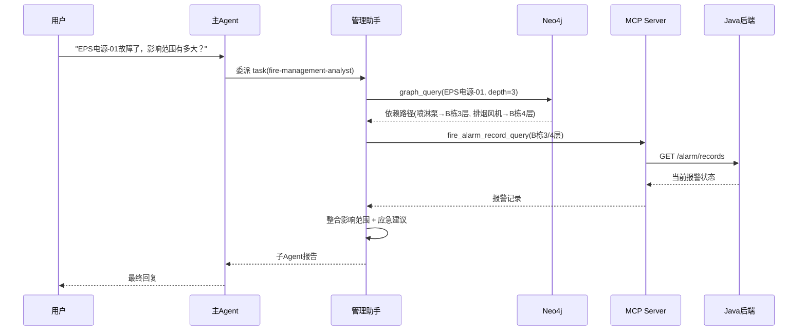

# 消防后勤智能助手 — 项目架构文档

> 最后更新：2026-06-14

---

## 一、项目概述

本项目是一个基于 **LangGraph + DeepAgents 框架** 构建的**消防后勤智能助手**，服务于医疗机构消防后勤部门。核心架构采用 **"主 Agent + 子 Agent 委派"** 模式，通过 MCP 协议对接 Java 后端业务 API，集成 **GraphRAG（向量数据库 + 图数据库）** 实现知识问答，使用 OpenSandbox 沙箱执行自定义分析代码，并以中间件机制实现可插拔的功能扩展。

### 业务范围

| 业务模块 | 说明 |
|----------|------|
| 火警故障 | 现场设备火警/故障报警记录的同步与查询 |
| 消防值班 | 值班排班与值班记录管理 |
| 消防巡检 | 巡检计划、执行记录、完成率统计 |
| 消防维修 | 维修工单创建与跟踪 |
| 消防维保 | 维保计划与执行记录 |
| 设备管理 | 消防设备全生命周期追踪 |
| 能耗监测 | 电能、水能数据监测与趋势分析 |

### 技术栈

| 层级 | 技术 | 说明 |
|------|------|------|
| Agent 框架 | deepagents (基于 LangGraph) | 核心 |
| LLM | DeepSeek (ChatOpenAI 兼容) | 主推理 |
| MCP Server | FastMCP | 工具协议层 |
| 向量数据库 | Milvus | GraphRAG 语义检索 |
| 图数据库 | Neo4j | GraphRAG 关联遍历 |
| 文档解析 | DotsOCR | PDF/图片 → Markdown |
| Embedding | DashScope text-embedding-v4 | 1024维中文向量化 |
| 沙箱 | OpenSandbox | 自定义代码执行 |
| HTTP 代理 | httpx (AsyncClient) | MCP→Java转发 |
| 数据存储 | InMemoryStore → 持久化Store | 用户偏好 |
| Checkpoint | MongoDB | Agent 状态持久化 |
| 子 Agent 配置 | YAML | 声明式定义 |
| 质量评估 | RAGAS | 问答质量保障 |

---

## 二、整体架构图



---

## 三、子智能体架构

### 3.1 两个子智能体定位

| 子智能体 | 名称 | 核心能力 | 实现方式 |
|----------|------|----------|----------|
| **知识问答助手** | `fire-qa-assistant` | 回答系统操作说明、消防法规规范、设备知识等问题 | GraphRAG（向量+图融合） |
| **管理分析助手** | `fire-management-analyst` | 业务数据统计报表、质量评鉴、改进建议、故障影响链分析 | MCP工具（Java端聚合+评鉴）+ 图遍历 + 沙箱 |

### 3.2 主 Agent 路由规则

| 用户意图 | 路由目标 | 示例 |
|----------|----------|------|
| 系统使用方法 | `fire-qa-assistant` | "消防巡检模块怎么录入数据？" |
| 消防法规/规范 | `fire-qa-assistant` | "ICU病房的消防系统要满足哪些要求？" |
| 设备操作流程 | `fire-qa-assistant` | "烟感探测器误报后如何复位？" |
| 消防知识科普 | `fire-qa-assistant` | "灭火器有哪几种类型？" |
| 数据统计与报表 | `fire-management-analyst` | "本月各区域巡检完成率" |
| 质量评鉴 | `fire-management-analyst` | "对比本季度和上季度的能耗情况" |
| 故障影响链 | `fire-management-analyst` | "EPS电源-01故障影响了谁？" |

### 3.3 GraphRAG 问答助手架构

#### 核心流程

```
用户问题
  │
  ├─ Step 1: 实体抽取（LLM/NER提取关键实体）
  │
  ├─ Step 2: 并行检索
  │    ├── 2a. 向量检索（Milvus混合检索 Top-K）
  │    └── 2b. 图遍历（Neo4j Cypher路径查询）
  │
  ├─ Step 3: 去重融合（向量片段+图路径合并排序）
  │
  ├─ Step 4: LLM生成（综合上下文，结构化回答）
  │
  └─ Step 5: RAGAS评估
       ├── score ≥ 0.7 → 输出
       └── score < 0.7 → 人工审批 / 兜底提示
```

#### 工具选择策略

| 问题复杂度 | 工具 | 说明 |
|-----------|------|------|
| 简单问答 | `knowledge_search` | 纯向量检索，单文档/单条款 |
| 复杂关联 | `graph_rag_search` | 向量+图遍历+融合，一键返回 |
| 已知起点深度遍历 | `graph_query` | 纯图查询，沿关系路径扩展 |

#### 知识图谱设计（Neo4j）

**三个子图**：

| 子图 | 节点 | 关系 | 用途 |
|------|------|------|------|
| 系统操作子图 | Module, Function, Step, Requirement | 包含功能, 操作步骤, 下一步, 前置条件 | 系统操作导航 |
| 法规关联子图 | Regulation, Clause, Standard, ZoneType | 包含条款, 引用, 适用法规, 要求配置 | 法规关联检索 |
| 设备依赖子图 | Equipment, Zone, EquipmentType | 安装于, 属于分类, 依赖(供电/控制) | 故障影响链 |

#### 向量数据库设计（Milvus）

| Collection | 用途 | 数据来源 |
|------------|------|----------|
| `fire_doc_collection` | 静态知识文档 | 法规/标准/手册/操作文档切分 |
| `fire_context_collection` | 对话历史 | AI回复自动写入 |
| `fire_image_collection` | 图文混合 | 含图片的文档 |

### 3.4 管理分析助手架构

#### 核心设计理念：确定性计算下沉

```
LLM擅长：解读、建议、组织呈现
LLM不擅长：算数、逻辑判断、一致性

→ 报表指标计算、目标值对比、评鉴判断 → Java后端MCP Tool
→ 数据解读、趋势分析、改进建议 → LLM
```

#### 工具分层

| 层级 | 工具 | 说明 |
|------|------|------|
| **高层聚合** | `fire_report_generate` | Java端SQL聚合，一次调用拿完整报表 |
| **高层评鉴** | `fire_quality_evaluate` | Java端对比目标值，返回达标/异常评级 |
| **明细查询** | 6个 `fire_*_query` | 查单条明细，不做聚合计算 |
| **图遍历** | `graph_query` | 限定场景：故障影响链分析 |
| **沙箱** | OpenSandbox | 自定义计算/可视化（MCP覆盖不了时） |

**禁止用明细工具做聚合计算**——"本月巡检完成率"应调 `fire_report_generate`，不应调5次 `fire_inspection_query` 自己算。

#### 质量评鉴维度

| 模块 | 关键指标 | 健康标准（参考值，实际由Java端配置） |
|------|----------|------|
| 巡检 | 完成率、逾期率、异常发现率 | 完成率≥95%，逾期率≤5% |
| 维修 | 平均响应时长、完工率、积压数 | 响应≤24h，完工率≥90% |
| 维保 | 计划完成率、设备覆盖率 | 完成率≥90%，覆盖率100% |
| 值班 | 出勤率、缺岗次数 | 出勤率100%，缺岗0次 |
| 能耗 | 用量同比/环比、单位面积能耗 | 环比不增长，同比无异常跳变 |
| 火警/故障 | 报警频次、误报率、恢复时长 | 误报率≤10%，恢复时长≤2h |

#### 故障影响链分析（graph_query 限定场景）

```
EPS电源-01故障
  → graph_query 沿 供电给/控制/联动 遍历
  → 喷淋泵-01 → B栋3层分区
  → 排烟风机-02 → B栋4层分区
  → 结合 fire_alarm_record_query 查当前报警
  → 输出：影响范围 + 应急建议
```

⚠️ graph_query 仅用于故障影响链分析，常规数据查询走MCP工具。

---

## 四、目录结构

```
src/
├── agent/                              # [核心] Agent 构建与配置
│   ├── main_agent.py                   # ★ 主入口 - create_main_agent()
│   ├── config.py                       # 路径常量 / Store / Checkpoint / GraphRAG配置
│   ├── llm_config.py                   # LLM 模型实例化 (DeepSeek)
│   ├── env_utils.py                    # 环境变量加载 (.env → os.environ)
│   ├── schema.py                       # 数据结构定义（FireLogisticsContext等）
│   ├── middleware_config.py            # 子Agent中间件工厂
│   ├── mcp_tools_bean.py              # 消防业务数据模型 (Pydantic)
│   │
│   ├── memory/                         # 记忆与提示词
│   │   ├── AGENTS.md                   # Agent 行为准则（消防后勤场景）
│   │   └── prompts.py                  # system_prompt 定义
│   │
│   ├── backends/                       # 沙箱后端实现
│   │   ├── custom_opensandbox.py       # OpenSandboxBackend 封装
│   │   └── sandbox_setup.py            # 沙箱初始化/文件播种
│   │
│   ├── middlewares/                    # 中间件集合
│   │   ├── context_injection.py        # 用户信息 → SystemMessage
│   │   ├── memory_update.py            # 自动提取关键词更新偏好
│   │   └── tools_summarization.py      # 上下文摘要/压缩
│   │
│   ├── subagents/                      # 子 Agent 管理
│   │   ├── read_yaml.py                # YAML解析 + assemble_subagents
│   │   └── agents/
│   │       ├── fire_qa_assistant.yaml  # 知识问答助手配置
│   │       └── fire_management_analyst.yaml  # 管理分析助手配置
│   │
│   └── tools/                          # Agent 工具
│       └── MCP_client.py               # MCP 工具客户端
│
├── graph_rag/                          # [核心] GraphRAG 模块
│   ├── __init__.py
│   ├── orchestrator.py                 # GraphRAG查询编排器（核心入口）
│   ├── entity_extractor.py             # 实体抽取（LLM/NER）
│   ├── graph_traverser.py              # 图遍历（Neo4j Cypher查询）
│   ├── vector_retriever.py             # 向量检索（Milvus混合检索）
│   ├── context_fusion.py               # 去重融合（向量片段+图路径合并）
│   ├── evaluator.py                    # RAGAS质量评估
│   │
│   ├── graph_db/                       # 图数据库操作
│   │   ├── schema.py                   # 图模型定义（节点/关系/属性）
│   │   ├── connection.py               # Neo4j连接管理
│   │   └── queries.py                  # 常用Cypher查询模板
│   │
│   ├── vector_db/                      # 向量数据库操作
│   │   ├── collections.py              # Collection Schema定义
│   │   ├── db_operator.py              # 数据插入
│   │   └── db_retriever.py             # 检索：稠密/稀疏/混合
│   │
│   ├── ingestion/                      # 数据写入管线
│   │   ├── doc_parser/                # 多模态文档解析
│   │   │   ├── __init__.py            # 统一输出格式 ParsedDocument
│   │   │   ├── dispatcher.py          # 格式识别与引擎路由
│   │   │   ├── pdf_parser.py          # PDF解析（DotsOCR + 嵌入图片提取）
│   │   │   ├── image_parser.py        # 图片解析（OCR + 多模态LLM描述）
│   │   │   ├── office_parser.py       # Word/HTML解析（Unstructured）
│   │   │   └── md_parser.py           # Markdown直接读取
│   │   ├── splitter.py                 # Markdown切分
│   │   ├── embedding.py                # Embedding向量化
│   │   ├── entity_relation_extractor.py # 实体/关系抽取（文档→图）
│   │   └── biz_sync.py                 # 业务数据同步（Java DB → Neo4j）
│   │
│   └── config.py                       # GraphRAG配置
│
├── mcp_server/                         # MCP 服务端
│   ├── server_main.py                  # FastMCP 入口
│   ├── server_config.py               # 服务端配置
│   ├── http_base.py                    # lifespan 管理 (httpx 生命周期)
│   └── tools/
│       ├── knowledge_tools.py          # 知识检索工具（graph_rag_search等）
│       ├── report_tools.py             # 报表评鉴工具（fire_report_generate等）
│       ├── fire_equipment_tools.py     # 设备查询
│       ├── fire_alarm_tools.py         # 火警/故障记录
│       ├── fire_inspection_tools.py    # 巡检记录
│       ├── fire_maintenance_tools.py   # 维修/维保工单
│       ├── fire_duty_tools.py          # 值班排班
│       └── fire_utility_tools.py       # 能耗监测
│
├── api_view/                           # API 视图层
├── test/                               # 测试
└── unitl_tools/                        # 公共工具
    └── logger.py                       # 统一日志配置
```

---

## 五、核心模块详解

### 5.1 主 Agent 构建流程

`create_main_agent()` 工厂函数执行初始化流程：

```
┌─────────────────────────────────────────────────────┐
│  1. 创建沙箱 (setup_sandbox)                        │
├─────────────────────────────────────────────────────┤
│  2. 上传 AGENTS.md 到沙箱                           │
├─────────────────────────────────────────────────────┤
│  3. CompositeBackend 分流                           │
│     ├── /memories/  → StoreBackend (按user隔离)     │
│     └── 其他路径    → OpenSandbox                   │
├─────────────────────────────────────────────────────┤
│  4. MCP 工具加载 (load_mcp_tools)                   │
├─────────────────────────────────────────────────────┤
│  5. 工具池构建 → available_tools                    │
├─────────────────────────────────────────────────────┤
│  6. 子 Agent YAML 加载 + 工具解析 (assemble)        │
├─────────────────────────────────────────────────────┤
│  7. 子 Agent 中间件注入                             │
├─────────────────────────────────────────────────────┤
│  8. 主 Agent 中间件链组装                           │
├─────────────────────────────────────────────────────┤
│  9. create_deep_agent() 创建主Agent                 │
└─────────────────────────────────────────────────────┘
```

### 5.2 后端分流架构 (CompositeBackend)

```python
CompositeBackend(
    default=sandbox_backend,           # 沙箱：代码执行、临时文件、AGENTS.md
    routes={
        "/memories/": StoreBackend(     # 用户偏好持久化
            namespace=lambda rt: (getattr(rt.context, 'user_id', None),)
        ),
    },
)
```

> **与原项目的变化**：去掉了 `/persisted-skills/` 路由。原项目的技能持久化机制（assign_skills工具 + SkillsSync中间件 + UserSkillsRestore中间件）在新项目中不再需要，因为两个子智能体都不使用静态skills文件。

### 5.3 中间件链

中间件按顺序在 Agent 生命周期中执行：

| 序号 | 中间件 | 类型 | Hook | 功能 | 状态 |
|------|--------|------|------|------|------|
| 1 | ContextInjectionMiddleware | 自定义 | `before_agent` | 将 user_id/username 注入 SystemMessage | ✅ 保留，优化提示模板 |
| 2 | MemoryUpdateMiddleware | 自定义 | `aafter_agent` | LLM 提取关键词，自动更新用户偏好 | ✅ 保留，关键词改消防领域 |
| 3 | ToolSummarizationMiddleware | 框架内置 | 自动触发 | 上下文过长时自动摘要压缩 | ✅ 保留 |
| 4 | ModelCallLimitMiddleware | 框架内置 | - | 限制模型调用 ≤50 次 | ✅ 保留 |
| 5 | ToolCallLimitMiddleware | 框架内置 | - | 限制工具调用 ≤200 次 | ✅ 保留 |

#### 已移除的中间件

| 中间件 | 原因 |
|--------|------|
| SkillsSyncMiddleware | 新项目子智能体不使用静态skills文件，同步无意义 |
| UserSkillsRestoreMiddleware | 原项目已标注"取消实现"，且技能恢复机制不再需要 |

### 5.4 中间件优化详情

#### ContextInjectionMiddleware — 优化

| 改动 | 原内容 | 新内容 |
|------|--------|--------|
| 提示模板 | 含 `preferred_currency`、供应商偏好路径 | 改为消防场景：关注区域、设备偏好路径 |
| 用户上下文 | `ProcurementContext` | `FireLogisticsContext` |

#### MemoryUpdateMiddleware — 优化

| 改动 | 原内容 | 新内容 |
|------|--------|--------|
| business_keywords | 采购相关（供应商、采购、零件、报价等） | 消防相关（巡检、维保、火警、故障、能耗、值班等），长期移至配置文件 |
| 实体提取字段 | `{suppliers: [...], query: "..."}` | `{equipment: [...], zones: [...], query: "..."}` |
| 实体提取方式 | 英文prompt + 手动json.loads | 中文prompt + with_structured_output结构化输出 |
| 偏好字段 | recent_suppliers / preferred_currency | recent_equipment / recent_zones（新增）/ 去掉currency |
| 偏好存储 | Markdown手动解析60行 | Pydantic序列化/反序列化（短期）/ DB（长期） |

详见 5.7 节"记忆更新机制"。

#### ToolSummarizationMiddleware — 保留不变

通用摘要能力，上下文达85%自动压缩，提供 `compact_conversation` 工具供Agent主动压缩。无需针对消防场景改动。

### 5.5 数据模型 (`schema.py`)

| 模型 | 原名称 | 新名称 | 变化 |
|------|--------|--------|------|
| 运行时上下文 | `ProcurementContext` | `FireLogisticsContext` | 字段不变（user_id, username） |
| 用户偏好 | `UserPreferences` | `UserPreferences` | 去掉 `preferred_currency`，`recent_suppliers` → `recent_equipment` |
| 聊天请求/响应 | `ChatRequest/Response` | 不变 | 通用模型 |
| 消息模型 | `Message` | 不变 | 通用模型 |
| 会话模型 | `Session/SessionListResponse` | 不变 | 通用模型 |
| SSE流式事件 | `Stream*Event` | 不变 | 通用模型 |

### 5.6 MCP 工具体系 (`mcp_tools_bean.py`)

| 原模型 | 新模型 | 说明 |
|--------|--------|------|
| `SupplierQueryInput` | `FireEquipmentQueryInput` | 设备查询参数 |
| `SupplierItem` | `FireEquipmentItem` | 设备信息 |
| `SupplierQueryResult` | `FireEquipmentQueryResult` | 设备查询结果 |
| `PartSearchInput` | `FireAlarmRecordQueryInput` | 火警/故障记录查询 |
| `PartQueryInput` | `FireInspectionQueryInput` | 巡检记录查询 |
| `OrderDetailItem` | `FireMaintenanceOrderDetailItem` | 维修工单明细 |
| `OrderInput` | `FireMaintenanceOrderInput` | 维修工单请求 |
| `OrderSearchInput` | `FireReportGenerateInput` | 报表生成请求（新增） |
| — | `FireQualityEvaluateInput` | 质量评鉴请求（新增） |
| — | `FireDutyScheduleQueryInput` | 值班查询（新增） |
| — | `FireUtilityMonitorQueryInput` | 能耗查询（新增） |

### 5.7 记忆更新机制

#### 当前流程

```
Agent 回复完成 (aafter_agent)
  ↓
获取 user_id
  ↓
判断最后一条用户消息是否"有意义"
  ├── 跳过：打招呼、无意义消息
  ├── 检测：消防关键词匹配 + 子Agent委派
  └── 有意义 → LLM 提取实体
       ↓
  _extract_entities(model, user_msg, ai_summary)
       ↓
  返回: {equipment: [...], zones: [...], query: "..."}
       ↓
  写入 /memories/{user_id}/preferences.md
```

#### 当前实现的问题与优化方案

##### 问题1：关键词仍是采购领域

| 当前代码 | 问题 | 优化方案 |
|---------|------|---------|
| `business_keywords = ["供应商", "采购", "零件", ...]` | 采购关键词，消防消息全部被跳过 | 改为消防关键词，同时支持外部配置 |

```python
# 优化后
self.business_keywords = [
    "巡检", "维保", "维修", "火警", "故障", "报警",
    "值班", "能耗", "用电", "用水", "设备", "探测器",
    "喷淋", "灭火", "排烟", "疏散", "电源", "EPS",
    "法规", "规范", "标准", "合规", "验收",
    "完成率", "逾期", "误报", "积压",
]
```

长期：关键词列表移至 `config.yaml` 或 DB 配置表，支持热更新，无需改代码。

##### 问题2：实体提取prompt是英文且提取suppliers

| 当前代码 | 问题 | 优化方案 |
|---------|------|---------|
| 英文prompt `Extract procurement-related entities` | 与中文消防场景不匹配 | 中文prompt + 消防实体类型 |
| 提取 `suppliers` | 消防场景无供应商概念 | 提取 `equipment` + `zones` |
| 手动 `json.loads(text[start:end+1])` | 脆弱，LLM输出格式稍有偏差就解析失败 | `with_structured_output` 结构化输出 |

```python
# 优化后：结构化输出
from pydantic import BaseModel

class FireExtractedEntities(BaseModel):
    """消防后勤实体提取结果"""
    equipment: list[str] = []   # 提及的消防设备（如：烟感探测器-01、喷淋泵）
    zones: list[str] = []       # 提及的建筑区域（如：B栋3层、ICU病房）
    query: str = ""             # 用户查询摘要

structured_model = model.with_structured_output(FireExtractedEntities)
result = await structured_model.ainvoke(prompt)
# result.equipment / result.zones / result.query — 无需手动解析JSON
```

##### 问题3：偏好字段仍是采购模型

| 当前代码 | 问题 | 优化方案 |
|---------|------|---------|
| `recent_suppliers` | 消防场景无供应商 | `recent_equipment`（近期关注的消防设备） |
| 无区域偏好 | 用户常问特定区域 | 新增 `recent_zones`（近期关注的建筑区域） |
| `preferred_currency` | 消防场景无货币 | 删除 |
| Markdown手动解析 `_merge_preferences` 60行 | 脆弱，格式稍有偏差就解析失败 | 结构化存储（见下方） |

优化后偏好文件格式：

```markdown
preferred_output: table
preferred_chart_type: bar
preferred_language: zh
recent_equipment:
  - B栋烟感探测器
  - A栋喷淋泵
recent_zones:
  - B栋3层
  - ICU病房
recent_queries:
  - 本月巡检完成率统计
  - 上季度能耗对比分析
```

##### 问题4：偏好存储为Markdown文件手动解析

| 当前方式 | 问题 | 优化方案 |
|---------|------|---------|
| `/memories/{user_id}/preferences.md` | 手动解析Markdown行、正则匹配字段，脆弱且不可扩展 | **短期**：保持文件存储但用Pydantic序列化/反序列化替代手动解析；**长期**：迁至数据库 |

短期方案（最小改动）：

```python
# 优化后：用Pydantic做序列化/反序列化，替代60行Markdown解析
@dataclass
class UserPreferences:
    preferred_output: str | None = None
    preferred_chart_type: str | None = None
    preferred_language: str | None = None
    recent_equipment: list[str] = None   # 替代 recent_suppliers
    recent_zones: list[str] = None       # 新增
    recent_queries: list[str] = None

# 写入：直接序列化为YAML/JSON
content = yaml.dump(preferences)  # 一行替代 _merge_preferences 的60行

# 读取：直接反序列化
preferences = UserPreferences(**yaml.safe_load(content))  # 一行替代 _parse_list_items
```

长期方案（middleware-optimization.md 已规划）：

| 存储类型 | 适用场景 | 推荐选型 |
|---------|---------|---------|
| 关系型DB | 结构化偏好（设备列表、区域列表、查询历史） | MongoDB（项目已有）或PostgreSQL |
| 向量DB | 语义检索偏好（"这个用户之前问过类似问题吗"） | Milvus（项目已有） |

#### 优化后的完整流程

```
Agent 回复完成 (aafter_agent)
  ↓
Step 1: 获取 user_id（从 runtime.context）
  ↓
Step 2: 判断消息是否有意义
  ├── skip_words 匹配 → 跳过
  ├── business_keywords 匹配 → 有意义
  ├── 子Agent委派检测（messages中有task工具调用）→ 有意义
  └── 都不匹配 → 跳过
  ↓
Step 3: LLM 结构化提取实体
  输入: user_message + ai_summary
  输出: FireExtractedEntities(equipment=[...], zones=[...], query="...")
  方式: with_structured_output（替代手动JSON解析）
  ↓
Step 4: 读取现有偏好
  短期: 从 StoreBackend 读取 → Pydantic 反序列化
  长期: 从数据库查询
  ↓
Step 5: 合并更新
  recent_equipment: 新设备 + 旧设备（去重，最多10个）
  recent_zones: 新区域 + 旧区域（去重，最多5个）
  recent_queries: 新查询 + 旧查询（去重，最多5个）
  ↓
Step 6: 写入偏好
  短期: Pydantic 序列化 → StoreBackend 写入
  长期: 数据库 UPSERT
```

#### 与原项目的对照

| 维度 | 原项目（采购） | 新项目（消防后勤） |
|------|---------------|-------------------|
| 关键词 | 供应商、采购、零件、报价 | 巡检、维保、火警、故障、能耗 |
| 实体类型 | suppliers | equipment + zones |
| 实体提取方式 | 手动json.loads | with_structured_output |
| 偏好字段 | recent_suppliers, preferred_currency | recent_equipment, recent_zones |
| 偏好存储 | Markdown手动解析 | Pydantic序列化（短期）/ DB（长期） |

---

## 六、数据流全景

### 6.1 知识问答流程



### 6.2 管理分析流程



### 6.3 故障影响链流程



---

## 七、MCP Tool 接口设计

### 7.1 完整工具清单

| 工具名 | 类型 | 子智能体 | 后端接口 | 优先级 |
|--------|------|---------|----------|--------|
| `graph_rag_search` | GraphRAG组合 | qa-assistant | Python端编排 | P0 |
| `knowledge_search` | 向量检索 | qa-assistant | Milvus直连 | P0 |
| `graph_query` | 图遍历 | qa-assistant + management-analyst | Neo4j直连 | P1 |
| `fire_report_generate` | 聚合报表 | management-analyst | `/reports/generate` | **P0** |
| `fire_quality_evaluate` | 质量评鉴 | management-analyst | `/quality/evaluate` | **P0** |
| `fire_equipment_query` | 设备明细 | management-analyst | `/equipment/search` | P1 |
| `fire_alarm_record_query` | 火警/故障 | management-analyst | `/alarm/records` | P1 |
| `fire_inspection_query` | 巡检明细 | management-analyst | `/inspection/records` | P1 |
| `fire_maintenance_order_query` | 工单明细 | management-analyst | `/maintenance/orders` | P1 |
| `fire_duty_schedule_query` | 值班明细 | management-analyst | `/duty/schedules` | P1 |
| `fire_utility_monitor_query` | 能耗明细 | management-analyst | `/utility/monitor` | P1 |

### 7.2 关键接口定义

#### fire_report_generate — 聚合报表

```python
@mcp.tool(name="fire_report_generate")
async def fire_report_generate(
    report_type: str,              # inspection | maintenance | duty | utility | alarm | overall
    period: str,                   # week | month | quarter | year
    start_date: str | None = None,
    end_date: str | None = None,
    building: str | None = None,
) -> dict:
    """
    返回: { report_type, period, metrics: [{name, value, unit, target, status, change_pct}], details, generated_at }
    Java端完成SQL聚合计算，LLM只负责解读和组织呈现。
    """
```

#### fire_quality_evaluate — 质量评鉴

```python
@mcp.tool(name="fire_quality_evaluate")
async def fire_quality_evaluate(
    modules: list[str] | None = None,  # inspection/maintenance/duty/utility/alarm
    period: str = "month",
    compare_with: str = "last_period",  # last_period | same_period_last_year
    building: str | None = None,
) -> dict:
    """
    返回: { overall_rating, modules: [{module, rating, metrics, risks}], suggestions, evaluated_at }
    Java端对比实际值与目标值，健康标准可配置。LLM只负责解读和建议。
    """
```

#### graph_rag_search — GraphRAG组合检索

```python
@mcp.tool(name="graph_rag_search")
async def graph_rag_search(
    query: str,
    search_type: str = "hybrid",
    max_vector_results: int = 5,
    graph_depth: int = 2,
    score_threshold: float = 0.7,
) -> dict:
    """
    返回: { answer, sources: [{type, source_file/title, path}], score, status }
    向量检索找语义上下文，图遍历找结构关联，融合后返回。
    """
```

---

## 八、图数据库与向量数据库设计

### 8.1 知识图谱（Neo4j）

#### 节点类型

| 标签 | 属性 | 数据来源 |
|------|------|----------|
| `Module` | name, description, version | 系统文档 |
| `Function` | name, description, entry_path | 系统文档 |
| `Step` | order, description, action | 系统文档 |
| `Requirement` | type, description | 系统文档 |
| `Regulation` | name, code, publish_date | 法规文档 |
| `Clause` | number, content, summary | 法规文档 |
| `Standard` | name, code, version | 标准文档 |
| `ZoneType` | name, risk_level, description | 业务数据 |
| `EquipmentType` | name, category, specs | 业务数据+文档 |
| `Equipment` | id, name, install_date, status | 业务数据 |
| `Zone` | name, building, floor | 业务数据 |

#### 关系类型

| 关系 | 起点→终点 | 用途 |
|------|-----------|------|
| `包含功能` | Module → Function | 系统操作导航 |
| `操作步骤` | Function → Step | 系统操作指引 |
| `下一步` | Step → Step | 步骤顺序 |
| `前置条件` | Function/Step → Requirement | 操作前置要求 |
| `包含条款` | Regulation → Clause | 法规查询 |
| `引用` | Clause → Standard/Clause | 法规关联 |
| `适用法规` | ZoneType → Regulation | 法规适用性判断 |
| `要求配置` | Clause → EquipmentType | 设备合规检查 |
| `属于分类` | Zone → ZoneType | 场所属性判断 |
| `安装于` | Equipment → Zone | 设备定位 |
| `依赖` | Equipment → Equipment | 故障影响链 |

#### 图使用对比

| 维度 | 问答助手 | 管理助手 |
|------|---------|---------|
| 使用深度 | 重度 — GraphRAG核心 | 轻度 — 仅故障影响链 |
| 子图 | 全部三个子图 | 仅设备依赖子图 |
| 查询方式 | graph_rag_search（融合） | graph_query（纯遍历） |

### 8.2 向量数据库（Milvus）

| Collection | 用途 | 检索策略 |
|------------|------|----------|
| `fire_doc_collection` | 静态知识文档 | 混合检索（稠密+稀疏） |
| `fire_context_collection` | 对话历史 | 稠密检索 |
| `fire_image_collection` | 图文混合 | 多模态检索 |

### 8.3 数据写入管线

#### 多模态文档解析

```
知识文档（法规PDF / 操作手册Word / 设备照片PNG / 巡检报告MD）
  │
  ▼
doc_parser/dispatcher.py — 格式识别与引擎路由
  │
  ├── .pdf  → pdf_parser     (DotsOCR + VLLM → Markdown + 图片提取)
  ├── .png/.jpg → image_parser (OCR + 多模态LLM → 图片描述)
  ├── .docx/.html → office_parser (Unstructured → Markdown + 图片提取)
  └── .md   → md_parser      (直接读取 + 标准化处理)
  │
  ▼
统一输出: ParsedDocument(text, images, metadata)
  │
  ├─ text → splitter → embedding → Milvus fire_doc_collection
  │
  ├─ images → 多模态描述 → embedding → Milvus fire_image_collection
  │
  └─ text → entity_relation_extractor → Neo4j
      (法规→条款→引用→标准 / 模块→功能→步骤)
```

**统一输出格式**：

```python
@dataclass
class ParsedDocument:
    text: str                     # 解析后的 Markdown 文本
    images: list[ParsedImage]     # 提取的图片列表
    metadata: dict                # 元数据（source_file, format, page_count等）

@dataclass
class ParsedImage:
    path: str                     # 图片保存路径
    description: str              # 多模态LLM生成的图片描述
    position: str                 # 图片在文档中的位置标记（如"第3页"、"段落2后"）
```

#### 业务数据同步

```
Java后端业务数据库
  │
  ├─ 设备台账（设备-位置-状态） → Neo4j Equipment/Zone节点
  ├─ 设备依赖关系（供电/控制） → Neo4j 依赖边
  ├─ 建筑分区（区域-分类-风险等级） → Neo4j Zone/ZoneType节点
  │
  └─ 时序数据（能耗/报警流水） → 不入图，留在关系型DB
```

**同步方式**：Java后端业务变更时，通过消息队列或定时任务同步到Neo4j，保持图数据与业务数据一致性。

---

## 九、质量保障

### 9.1 RAGAS评估（问答助手）

| 指标 | 含义 | 阈值 | 不达标处理 |
|------|------|------|-----------|
| ContextRelevance | 检索上下文与问题的相关度 | ≥0.7 | 图遍历扩1跳后重试 |
| ResponseRelevancy | 回答与问题的相关度 | ≥0.7 | 人工审批或兜底提示 |

### 9.2 确定性计算保障（管理助手）

| 风险 | 保障措施 |
|------|----------|
| LLM算数错误 | 报表指标计算在Java端完成，LLM不参与计算 |
| 评鉴标准不一致 | 健康标准在Java端配置表管理，不硬编码在提示词中 |
| 明细工具滥用 | system_prompt明确禁止用明细工具做聚合，必须走高层工具 |

---

## 十、配置与依赖

### 环境变量 (`.env`)

| 变量 | 用途 |
|------|------|
| **LLM** | |
| `DEEPSEEKAPI` | DeepSeek API Key |
| `DEEPSEEKURL` | DeepSeek API 地址 |
| `DEEPSEEKMODEL` | 主模型 |
| `DEEPSEEKMODELFAST` | 快速模型（摘要/实体抽取） |
| `APP_ENV` | 运行环境 |
| **GraphRAG** | |
| `NEO4J_URI` | Neo4j 连接地址 |
| `NEO4J_USER` / `NEO4J_PASSWORD` | Neo4j 认证 |
| `MILVUS_HOST` / `MILVUS_PORT` | Milvus 连接 |
| `DASHSCOPE_API_KEY` | 阿里云DashScope（Embedding） |
| `DOTS_OCR_URL` | DotsOCR服务地址 |
| **后端** | |
| `JAVA_API_BASE_URL` | Java后端API地址 |
| `MCP_SERVER_URL` | MCP Server地址 |
| `MONGODB_URI` | MongoDB连接 |

### 外部服务

| 服务 | 用途 |
|------|------|
| Java 后端 API | 消防后勤业务数据 + 报表聚合 + 质量评鉴 |
| MCP Server | FastMCP Streamable HTTP |
| Neo4j | 知识图谱存储与遍历 |
| Milvus | 向量检索 |
| DotsOCR | 文档解析 |
| OpenSandbox | 代码执行沙箱 |
| MongoDB | Agent Checkpoint 持久化 |

---

## 十一、设计模式总结

| 模式 | 体现 |
|------|------|
| **工厂模式** | `create_main_agent()` 每次调用创建全新实例 |
| **中间件/管道模式** | Agent 生命周期钩子链 |
| **委派模式** | 主Agent 委派给子Agent（task 工具） |
| **策略模式** | CompositeBackend 按路径分流 |
| **配置驱动** | 子Agent通过YAML声明式定义 |
| **确定性下沉** | 计算逻辑下沉Java端，LLM只做解读+建议 |
| **GraphRAG融合** | 向量检索（语义）+ 图遍历（结构）+ 去重融合 |

---

## 十二、与原项目的对照

### 保留并适配

| 组件 | 原项目（采购） | 新项目（消防后勤） | 改动 |
|------|---------------|-------------------|------|
| 主Agent工厂 | `create_main_agent()` | 不变 | 业务参数替换 |
| CompositeBackend | 三路分流 | 两路分流（去掉persisted-skills） | 简化 |
| ContextInjection | 采购上下文 | 消防后勤上下文 | 提示模板改写 |
| MemoryUpdate | 供应商/采购关键词 | 消防/巡检/能耗关键词 | 关键词+实体改写 |
| ToolSummarization | 不变 | 不变 | — |
| ModelCallLimit / ToolCallLimit | 不变 | 不变 | — |
| MCP两层架构 | FastMCP+httpx+Java | 不变 | 工具替换 |
| OpenSandbox | 代码执行 | 保留（管理助手自定义分析） | — |
| MongoDB Checkpoint | 不变 | 不变 | — |
| 子Agent YAML配置 | analyst.yaml | 2个消防yaml | — |
| ChatRequest/Response | 不变 | 不变 | — |
| Stream*Event | 不变 | 不变 | — |

### 新增

| 组件 | 说明 |
|------|------|
| Milvus | GraphRAG向量检索 |
| Neo4j | GraphRAG图遍历 |
| GraphRAG Orchestrator | 查询编排（实体抽取→并行检索→融合→LLM生成→评估） |
| DotsOCR | 文档解析入库 |
| DashScope Embedding | 文本/多模态向量化 |
| RAGAS | 问答质量评估 |
| fire_report_generate | 聚合报表MCP Tool |
| fire_quality_evaluate | 质量评鉴MCP Tool |
| 6个明细MCP Tool | 设备/火警/巡检/维修/值班/能耗 |

### 移除

| 组件 | 原因 |
|------|------|
| SkillsSyncMiddleware | 新项目子智能体不使用静态skills文件 |
| UserSkillsRestoreMiddleware | 原项目已标注"取消实现"，技能恢复机制不再需要 |
| assign_skills 工具 | 不使用skills机制，无需技能分配工具 |
| /persisted-skills/ 路由 | 无技能持久化需求 |
| preferred_currency 字段 | 消防场景无货币偏好 |
| recent_suppliers 字段 | 改为 recent_equipment |

---

## 十三、实施路线图

```
Phase 1（基础跑通）- 2周
  ├── 数据模型改写（schema.py / mcp_tools_bean.py）
  ├── 中间件适配（关键词/实体/偏好字段改消防领域）
  ├── 6个明细MCP Tool（改造suppliers_tools.py为消防工具）
  ├── Java后端对应API对接
  └── 验证：主Agent → 子Agent委派 → MCP Tool调用 → 回复

Phase 2（GraphRAG基础）- 2周
  ├── Milvus部署 + Collection创建
  ├── Neo4j部署 + 图Schema定义
  ├── knowledge_search MCP Tool（纯向量检索）
  ├── graph_query MCP Tool（纯图遍历）
  ├── 手工录入测试数据（法规+操作手册+设备依赖）
  └── 验证：问题 → 向量检索/图遍历 → 回答

Phase 3（GraphRAG融合 + 管理助手核心）- 2周
  ├── context_fusion 去重融合模块
  ├── graph_rag_search MCP Tool（组合检索）
  ├── fire_report_generate MCP Tool + Java端报表API
  ├── fire_quality_evaluate MCP Tool + Java端评鉴API
  ├── 评鉴标准配置表
  └── 验证：问答助手GraphRAG端到端 + 管理助手报表评鉴

Phase 4（数据管线 + 完善）- 2周
  ├── doc_parser + splitter 文档自动入库
  ├── entity_relation_extractor 文档→图自动抽取
  ├── biz_sync 业务数据同步（Java DB → Neo4j）
  ├── RAGAS评估接入
  ├── API视图层（api_view）
  └── 端到端全面测试

Phase 5（优化迭代）- 持续
  ├── RAGAS评估调优
  ├── 图遍历策略优化
  ├── 沙箱自定义分析场景
  ├── 检索性能优化（缓存、预计算热点路径）
  ├── 持久化Store（InMemoryStore → MongoDBStore）
  └── 可观测性（LangSmith接入）
```
