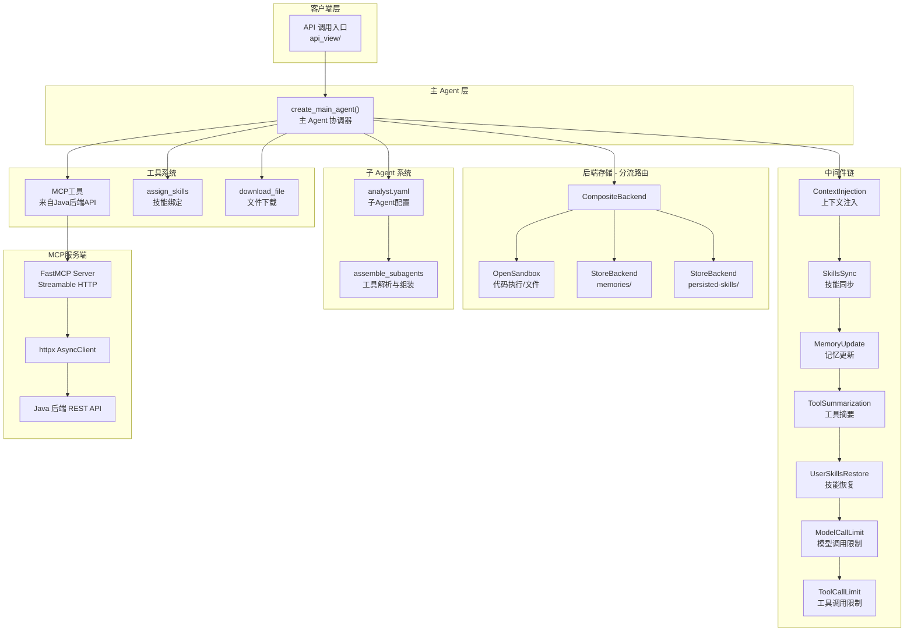
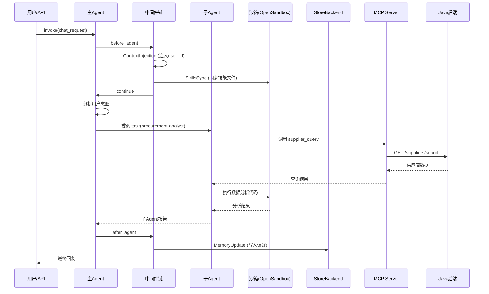
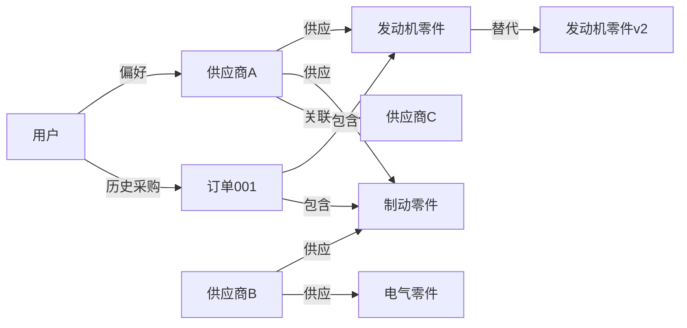

# DeepAgentsDemo2 项目架构文档

## 一、项目概述

本项目是一个基于 **LangGraph + DeepAgents 框架** 构建的智能 Agent 系统，主要用于**采购业务场景**。核心架构采用 **"主 Agent + 子 Agent 委派"** 模式，通过 MCP 协议对接后端业务 API，使用 OpenSandbox 沙箱执行代码，并以中间件机制实现可插拔的功能扩展。

### 技术栈

| 层级 | 技术 |
|------|------|
| Agent 框架 | deepagents (基于 LangGraph) |
| LLM | DeepSeek (ChatOpenAI 兼容) |
| MCP Server | FastMCP |
| 沙箱 | OpenSandbox (sdk-python) |
| HTTP 代理 | httpx (AsyncClient) |
| 数据存储 | InMemoryStore + MongoDB Checkpoint |
| 子 Agent 配置 | YAML |

---

## 二、整体架构图



---

## 三、目录结构与模块职责

```
project/
├── docs/
│   ├── agent-context-guide.md     # state/runtime 上下文概念指南
│   └── project-architecture.md    # 本文档
├── src/
│   ├── agent/                     # [核心] Agent 构建与配置
│   │   ├── main_agent.py          # ★ 主入口 - create_main_agent()
│   │   ├── config.py              # 路径常量/Store/Checkpoint 配置
│   │   ├── llm_config.py          # LLM 模型实例化 (DeepSeek)
│   │   ├── env_utils.py           # 环境变量加载 (.env → os.environ)
│   │   ├── schema.py              # 数据结构定义
│   │   ├── context_injection.py   # 运行时上下文注入 (入口)
│   │   ├── middleware_config.py   # 子Agent中间件工厂 (空)
│   │   ├── mcp_tools_bean.py      # 采购业务数据模型 (Pydantic)
│   │   ├── backends/              # 沙箱后端实现
│   │   │   ├── custom_opensandbox.py  # OpenSandboxBackend 封装
│   │   │   └── sandbox_setup.py       # 沙箱初始化/文件播种
│   │   ├── memoy/                 # 记忆与提示词
│   │   │   ├── AGENTS.md          # Agent 行为准则 (空)
│   │   │   └── prompts.py         # system_prompt 定义
│   │   ├── middlewares/           # 中间件集合
│   │   │   ├── context_injection.py   # 用户信息 → SystemMessage
│   │   │   ├── memory_update.py       # 自动提取关键词更新偏好
│   │   │   ├── skills_sync.py         # 本地技能 ↔ 沙箱同步
│   │   │   ├── tools_sunnarization.py # 上下文摘要/压缩
│   │   │   └── user_skills_restore.py # StoreBackend → 沙箱恢复 (预留)
│   │   ├── subagents/             # 子 Agent 管理
│   │   │   ├── read_yaml.py       # YAML解析 + assemble_subagents
│   │   │   └── agents/
│   │   │       └── analyst.yaml   # 子Agent配置模板
│   │   └── tools/                 # Agent 工具
│   │       ├── assign_skills.py   # 技能绑定工具 (空)
│   │       ├── MCP_client.py      # MCP 工具客户端
│   │       └── __init__.py
│   ├── api_view/                  # API 视图层 (空)
│   ├── mcp_server/                # MCP 服务端
│   │   ├── server_main.py         # FastMCP 入口
│   │   ├── server_config.py       # 服务端配置
│   │   ├── http_base.py           # lifespan 管理 (httpx 生命周期)
│   │   └── tools/
│   │       └── suppliers_tools.py # 供应商查询工具
│   ├── test/                      # 测试 (空)
│   └── unitl_tools/               # 公共工具
│       └── logger.py              # 统一日志配置
└── extensions.txt                 # VS Code 扩展推荐
```

---

## 四、核心模块详解

### 4.1 主 Agent 构建流程 (`main_agent.py`)

`create_main_agent()` 是整个系统的核心工厂函数，执行完整的 9 步初始化流程：

```
┌─────────────────────────────────────────────────────┐
│  1. 创建沙箱 (setup_sandbox)                        │
│     ├── 重连已有沙箱 或 新建沙箱                     │
│     ├── 播种 skills 文件到沙箱                       │
│     └── 创建 Python venv + 安装依赖                  │
├─────────────────────────────────────────────────────┤
│  2. 上传 AGENTS.md 到沙箱                           │
├─────────────────────────────────────────────────────┤
│  3. CompositeBackend 分流                           │
│     ├── /memories/       → StoreBackend (按user隔离)│
│     ├── /persisted-skills/ → StoreBackend (技能持久) │
│     └── 其他路径          → OpenSandbox             │
├─────────────────────────────────────────────────────┤
│  4. MCP 工具加载 (load_mcp_tools)                   │
├─────────────────────────────────────────────────────┤
│  5. 技能管理工具创建 (assign_skills + download)      │
├─────────────────────────────────────────────────────┤
│  6. 工具池构建 → available_tools                    │
├─────────────────────────────────────────────────────┤
│  7. 子 Agent YAML 加载 + 工具解析 (assemble)        │
├─────────────────────────────────────────────────────┤
│  8. 主Agent中间件链组装                              │
├─────────────────────────────────────────────────────┤
│  9. create_deep_agent() 创建主Agent                 │
└─────────────────────────────────────────────────────┘
```

### 4.2 后端分流架构 (CompositeBackend)

```python
# 三路分流设计
CompositeBackend(
    default=sandbox_backend,           # 沙箱：临时文件、代码执行
    routes={
        "memories": StoreBackend(      # 用户偏好持久化
            namespace=lambda rt: (user_id,)
        ),
        "persisted-skills": StoreBackend(  # 技能持久化
            namespace=SKILLS_STORE_NAMESPACE
        ),
    }
)
```

| 路由 | 后端 | 用途 |
|------|------|------|
| `default` | OpenSandbox | 代码执行、临时文件、AGENTS.md |
| `memories/` | StoreBackend | 按 user_id 隔离的用户偏好 |
| `persisted-skills/` | StoreBackend | 全局持久化技能 |

### 4.3 上下文五层模型

项目遵循 DeepAgents 框架的五层上下文体系（详见 `docs/agent-context-guide.md`）：

| 层次 | 载体 | 生命周期 | 本项目中体现 |
|------|------|----------|-------------|
| 输入上下文 | `state` 初始化 | 单次调用 | system_prompt, skills, memories |
| 运行时上下文 | `runtime.context` | 单次调用 | user_id, username (ProcurementContext) |
| 上下文压缩 | `state` 内部 | 自动触发 | SummarizationMiddleware (tools_sunnarization.py) |
| 上下文隔离 | 子Agent独立 state/runtime | 子Agent生命周期 | subagents 独立运行 |
| 长期记忆 | `runtime.store` | 跨会话持久 | StoreBackend → /memories/ |

### 4.4 中间件链

中间件按顺序在 Agent 生命周期中执行：

| 序号 | 中间件 | 类型 | Hook | 功能 |
|------|--------|------|------|------|
| 1 | ContextInjectionMiddleware | 自定义 | `before_agent` | 将 user_id/username 注入 SystemMessage |
| 2 | SkillsSyncMiddleware | 自定义 | `before_agent` | 本地技能文件 → 沙箱同步，有变更通知 |
| 3 | MemoryUpdateMiddleware | 自定义 | `aafter_agent` | LLM 提取关键词，自动更新用户偏好 |
| 4 | ModelCallLimitMiddleware | 框架内置 | - | 限制模型调用 ≤50 次 |
| 5 | ToolCallLimitMiddleware | 框架内置 | - | 限制工具调用 ≤200 次 |

### 4.5 子 Agent 系统

**配置驱动**：子 Agent 通过 YAML 文件定义，由 `read_yaml.py` 解析：

```yaml
# analyst.yaml 示例
name: analyst
description: 子智能体描述
tools:
  - tool1
  - tool2
system_prompts: 子智能体 system prompt
skills:
  - skill地址
```

**工具解析流程**：

```
YAML 文件 → load_yaml() → assemble_subagents()
                              ↓
                    resolve_tools(subagent, tool_map)
                              ↓
               ┌──────────────┴──────────────┐
               │ group 前缀匹配               │
               │ (name.startswith("group_"))  │
               │                              │
               │ include 名称匹配             │
               │ (name in tool_map)           │
               └──────────────────────────────┘
                              ↓
                    子Agent 配置 + 工具实例
```

### 4.6 MCP 工具系统

**两层架构**：

```
Agent 层 (MCP Client)              MCP 服务层 (MCP Server)
┌─────────────────────┐           ┌──────────────────────┐
│ MultiServerMCPClient│──streamable-http──→│ FastMCP Server       │
│                     │           │ ├── supplier_query     │
│ load_mcp_tools()    │           │ └── (可扩展更多工具)   │
│ → tool_map{name:tool}│          │                      │
└─────────────────────┘           │ httpx AsyncClient     │
                                  └──────┬───────────────┘
                                         │ HTTP REST
                                  ┌──────▼───────────────┐
                                  │ Java 后端 API         │
                                  │ /suppliers/search     │
                                  │ /parts/...            │
                                  │ /orders/...           │
                                  └──────────────────────┘
```

- **MCP Client** (`MCP_client.py`)：使用 `langchain_mcp_adapters` 连接 MCP Server，获取工具
- **MCP Server** (`server_main.py`)：FastMCP 封装，通过 `httpx` 转发到 Java 后端
- **lifespan 管理** (`http_base.py`)：用 `asynccontextmanager` 管理 HTTP 连接池生命周期

### 4.7 数据模型 (`schema.py`)

| 模型 | 用途 |
|------|------|
| `ProcurementContext` | 运行时用户上下文 (user_id, username) |
| `UserPreferences` | 用户偏好 (输出格式/货币/最近查询) |
| `ChatRequest/Response` | 聊天请求/响应 |
| `Message` | 消息模型 (含工具调用信息) |
| `Session` | 会话历史管理 |
| `Stream*Event` | SSE 流式事件模型 |

### 4.8 记忆更新机制 (`memory_update.py`)

```
Agent 回复完成 (aafter_agent)
  ↓
获取 user_id
  ↓
判断最后一条用户消息是否"有意义"
  ├── 跳过：打招呼、无意义消息
  ├── 检测：关键词匹配 + 子Agent委派
  └── 有意义 → LLM 提取实体
       ↓
  _extract_entities(model, user_msg, ai_summary)
       ↓
  返回: {suppliers: [...], query: "..."}
       ↓
  写入 /memories/{user_id}/preferences.md
```

---

## 五、数据流全景



---

## 六、配置与依赖

### 环境变量 (`.env`)

| 变量 | 用途 |
|------|------|
| `DEEPSEEKAPI` | DeepSeek API Key |
| `DEEPSEEKURL` | DeepSeek API 地址 |
| `DEEPSEEKMODEL` | 主模型 (如 deepseek-chat) |
| `DEEPSEEKMODELFAST` | 快速模型 (摘要用) |
| `APP_ENV` | 运行环境 (development/production) |

### 外部服务

| 服务 | 地址 | 用途 |
|------|------|------|
| Java 后端 API | `http://127.0.0.1:8000` | 采购业务数据 |
| MCP Server | `http://127.0.0.1:8000/mcp` | Streamable HTTP |
| OpenSandbox | `api.opensandbox.io` | 代码执行沙箱 |
| MongoDB | (配置在 config.py) | Checkpoint 持久化 |

---

## 七、设计模式总结

| 模式 | 体现 |
|------|------|
| **工厂模式** | `create_main_agent()` 工厂函数，每次调用创建全新实例 |
| **中间件/管道模式** | Agent 生命周期钩子链 (before/after_agent) |
| **委派模式** | 主Agent 将任务委派给子Agent (task 工具) |
| **策略模式** | CompositeBackend 按路径分流到不同后端 |
| **适配器模式** | OpenSandboxBackend 封装 SandboxSync → BaseSandbox 协议 |
| **配置驱动** | 子Agent 通过 YAML 声明式定义 |
| **lifespan 模式** | FastMCP 的 lifespan 管理 HTTP 连接池 |

---

## 八、待完善项

1. **`middleware_config.py`** — 子Agent中间件工厂方法目前为空    /已处理
2. **`tools/assign_skills.py`** — 技能绑定工具未实现            /
3. **`AGENTS.md`** — Agent 行为准则文件内容为空
4. **`memoy/`** 目录拼写应为 `memory/`（当前为 `memoy`）
5. **`api_view/`** — API 视图层待实现
6. **`test/`** — 测试模块待补充
7. **`user_skills_restore.py`** — 技能恢复中间件仅有注释 
8. **持久化存储** — `STORE` 当前使用 `InMemoryStore`（重启丢失），建议迁至持久化方案
9. **`checkpointer`** — 当前 MongoDB 连接变量未在 `config.py` 中显式定义

---

## 九、项目未完成内容与缺陷清单

> 审查日期：2026-06-13 | 最后更新：2026-06-14

### 🔴 严重缺陷（会导致运行崩溃）

| # | 文件 | 问题描述 | 状态 |
|---|------|----------|------|
| 1 | `config.py` | `_mongodb_client`、`MONGODB_DB_NAME`、`MONGODB_CHECKPOINT_COLLECTION` 三个变量未定义，`CHECKPOINT` 初始化会直接报错 | ✅ 已修改 |
| 2 | `main_agent.py` | `CompositeBackend`、`StoreBackend`、`create_download_tool`、`DOWNLOAD_DIR` 未导入/未定义，运行即崩溃 | ✅ 已修改 |
| 3 | `main_agent.py` | `subagents=subagents` 被注释掉，子Agent系统完全未启用 | ✅ 已修改 |
| 4 | `suppliers_tools.py` | `query_suppliers` 函数中使用了未定义变量 `request_params`，应为 `{"name": name}` | ✅ 已修改 |
| 5 | `main_agent.py` | `extra_mid` 字典创建了子Agent中间件但从未使用，`create_order_middleware()` 也未在 `middleware_config.py` 中定义 | ✅ 已修改 |
| 6 | `skills_sync.py` | `from config import ...` 使用了相对导入而非 `from agent.config import ...`，在包外运行会报错 | ✅ 已修改 |
| 7 | `main_agent.py` | `_is_intialized` 拼写错误，应为 `_is_initialized`，`get_agent()`/`get_agent_async()` 调用会报 `AttributeError` | ✅ 已修改 |
| 8 | `main_agent.py` | `from memory.prompts import system_prompt` 导入路径错误，应为 `from agent.memory.prompts` | ✅ 已修改 |
| 9 | `context_injection.py` | `ContextInjectionMiddleware` 未继承 `AgentMiddleware`，中间件链类型不一致 | ✅ 已修改 |
| 10 | `context_injection.py` | `ctx.get("user_id")` 对 `@dataclass` 无效，`ProcurementContext` 没有 `.get()` 方法，应使用 `getattr()` | ✅ 已修改 |
| 11 | `sandbox_setup.py` | `setup_sandbox(config)` 访问 `config.api_key`/`config.skills_dir`，但 `RunnableConfig` 无这些属性 | ✅ 已修改 |

### 🟡 功能未完成

| # | 文件 | 问题描述 | 状态 |
|---|------|----------|------|
| 1 | `api_view/__init__.py` | API视图层完全为空，无任何接口实现（ChatRequest/ChatResponse等Schema已定义但无路由） | ❌ 待实现 |
| 2 | `test/__init__.py` | 测试目录完全为空，无任何单元测试或集成测试 | ❌ 待实现 |
| 3 | `memory/AGENTS.md` | Agent行为准则文件内容极少，system_prompt中引用了此文件但无实质内容 | ❌ 待完善 |
| 4 | `user_skills_restore.py` | 技能恢复中间件只有文档注释，无任何代码实现 | ⏸️ 取消实现 |
| 5 | `middleware_config.py` | 缺少 `create_order_middleware()` 函数定义 | ✅ 已修改 |
| 6 | `analyst.yaml` | 子Agent配置为模板占位符（tool1/tool2/skill1等），非真实业务配置 | ❌ 待完善 |
| 7 | `mcp_server/tools/` | 仅实现了供应商查询，缺少零配件、订单等其他业务工具 | ❌ 待实现 |
| 8 | `config.py` | `STORE = InMemoryStore()` 注释标注"实际应该持久化"，生产环境会丢失数据 | ❌ 待完善 |
| 9 | `env_utils.py` | `DeepSeek_MODEL_FAST` 已定义但全项目未使用 | ❌ 待处理 |

### 🟠 代码质量问题

| # | 文件 | 问题描述 | 状态 |
|---|------|----------|------|
| 1 | `main_agent.py` | `_AgentProxy` 和 `_AngentProxy` 两个功能重复的懒加载代理类 | ✅ 已修改 |
| 2 | `read_yaml.py` | `assemble_subagent` 和 `assemble_subagents` 两个功能重复的函数 | ✅ 已修改 |
| 3 | `memory_update.py` | `business_keywords` 和 `skip_words` 均为占位符 | ✅ 已修改 |
| 4 | `memory_update.py` | `_merge_preferences` 方法不完整，`_parse_list_items` 内部函数截断 | ✅ 已修改 |
| 5 | `config.py` | `LOCAL_AGENTS_MD` 路径指向 `agent/memory/AGENTS.md`，但实际文件在 `agent/memoy/AGENTS.md` | ✅ 已修改 |
| 6 | `schema.py` | `ChatRequest` 继承了 `openai.BaseModel` 而非 `pydantic.BaseModel` | ✅ 已修改 |
| 7 | `skills_sync.py` | `_sync_files` 中 `is_dir()` 判断重复 | ✅ 已修改 |
| 8 | `suppliers_tools.py` | 工具返回类型为 `list`，缺少结构化的Pydantic输出模型 | ✅ 已修改 |
| 9 | `server_config.py` | MCP端口(8000)与Java后端API端口(8000)冲突 | ❌ 待修改 |
| 10 | `mcp_tools_bean.py` | 末尾有两行注释残留 | ✅ 已修改 |
| 11 | `memory_update.py` | `ex_suppliers` 变量定义但未使用（应为 `existing_suppliers`） | ✅ 已修改 |

### 🔵 架构/设计建议

| # | 建议 | 状态 |
|---|------|------|
| 1 | 目录名 `memoy` 应修正为 `memory`（拼写错误），需同步修改所有引用 | ✅ |
| 2 | `tools_sunnarization.py` 文件名拼写错误，应为 `tools_summarization.py` | ✅ |
| 3 | 缺少 `.env.example` 文件，新开发者无法知道需要哪些环境变量 | ❌ 待创建 |
| 4 | 缺少 `requirements.txt` 或 `pyproject.toml`，无法一键安装依赖 | ❌ 待创建 |
| 5 | 缺少项目入口文件（如 `main.py` / `app.py`），无法直接启动 | ❌ 待创建 |
| 6 | `MCP_client.py` 中 MCP Server 地址硬编码为 `127.0.0.1:8000`，应移至配置/环境变量 | ❌ 待修改 |
| 7 | `server_config.py` 中 Java API 地址硬编码，应使用环境变量 | ❌ 待修改 |
| 8 | 摘要中间件 `build_summarization_middleware` 在主Agent中间件链中已启用 | ✅ 已修改 |
| 9 | `sandbox_setup.py` 中 `setup_sandbox` 依赖 `config.api_key` 等属性，但 `RunnableConfig` 无这些属性 | ✅ 已修改 |

### 📋 优先修复建议

1. ~~**立即修复**：`config.py` MongoDB变量定义、`main_agent.py` 缺失导入、`suppliers_tools.py` 未定义变量~~ ✅ 已完成
2. ~~**立即修复**：`_is_intialized` 拼写、`from memory.prompts` 导入路径、`ctx.get()` dataclass问题、`ContextInjectionMiddleware` 继承、`sandbox_setup` config类型~~ ✅ 已完成
3. **尽快完成**：`AGENTS.md` 内容编写、`api_view` 接口实现、`analyst.yaml` 真实配置
4. **逐步完善**：补充测试、持久化Store、MCP工具扩展、环境变量外部化

---

## 十、技术扩展规划：RAG / 向量数据库 / 图数据库 / Agent 新技术

> 基于当前采购业务场景，分析各技术的适用业务与落地方案。

### 10.1 RAG + 向量数据库

#### 适用业务场景

| 场景 | 说明 | 向量库选型建议 |
|------|------|---------------|
| **采购政策/合同检索** | 采购规章制度、合同模板、合规条款等非结构化文档，Agent需按语义检索而非关键词匹配 | Milvus / Qdrant |
| **供应商资质文档** | 营业执照、认证证书、历史评审报告等PDF，Agent需快速定位"某供应商是否有ISO认证" | Milvus + 文档解析 |
| **历史采购分析报告** | 过往的供应商评估、价格趋势分析等长文档，支持"去年Q3某零件采购情况"的语义查询 | Chroma（轻量）/ Milvus |
| **产品规格/技术手册** | 零配件的技术参数手册，支持"耐高温200℃以上的密封件"这类模糊查询 | Qdrant + 结构化过滤 |

#### 架构集成方案

```
用户提问
  ↓
主Agent 判断是否需要知识检索
  ↓
调用 RAG 工具（新增 MCP Tool）
  ↓
┌─────────────────────────────┐
│  RAG Pipeline               │
│  1. Query → Embedding       │
│  2. 向量库 Top-K 检索        │
│  3. Rerank 重排序            │
│  4. 拼接上下文 → LLM         │
└─────────────────────────────┘
  ↓
返回检索增强的回答
```

#### 推荐技术栈

| 组件 | 推荐 | 理由 |
|------|------|------|
| 向量数据库 | **Milvus** (自部署) 或 **Qdrant** | Milvus 适合大规模生产；Qdrant 支持结构化过滤+向量混合查询，适合采购场景 |
| Embedding | **BGE-M3** / **text2vec-large-chinese** | 中文采购文档效果好，可本地部署 |
| 文档解析 | **Unstructured** / **PyMuPDF** | 支持PDF/Word/Excel等采购文档格式 |
| Reranker | **bge-reranker-v2-m3** | 中文重排序，提升检索精度 |
| RAG框架 | **LlamaIndex** 或 **LangChain Retrieval** | 与现有 LangGraph 生态无缝集成 |

#### 落地步骤

1. 新增 `src/agent/tools/rag_tool.py` — 封装为 MCP Tool
2. 新增 `src/mcp_server/tools/knowledge_tools.py` — MCP Server 端知识检索工具
3. 向量库独立部署，通过环境变量配置连接
4. 文档入库流程：上传 → 解析 → 分块 → Embedding → 写入向量库

---

### 10.2 图数据库

#### 适用业务场景

| 场景 | 说明 | 图模型示例 |
|------|------|-----------|
| **供应链关系网络** | 供应商-零件-订单多跳关系查询，如"哪些供应商同时供应A零件和B零件" | `(供应商)-供应→(零件)←采购-(订单)` |
| **供应商风险评估** | 关联分析：某供应商的下游供应商出问题，影响哪些订单 | `(供应商)-依赖→(供应商)` |
| **替代料推荐** | 当某零件缺货时，通过图关系找到规格相近的替代品 | `(零件)-相似→(零件)-供应→(供应商)` |
| **采购路径优化** | 多级供应商的最短路径/成本最优路径 | `(采购方)→(一级供应商)→(二级供应商)` |
| **用户偏好关联** | 当前 `UserPreferences` 中的 `recent_suppliers` 天然适合图结构 | `(用户)-偏好→(供应商)-供应→(零件类别)` |

#### 图模型设计



#### 推荐技术栈

| 组件 | 推荐 | 理由 |
|------|------|------|
| 图数据库 | **Neo4j** | 成熟稳定，Cypher查询语言表达力强，Python驱动完善 |
| 轻量替代 | **NetworkX** + Redis | 数据量小时可用内存图，无需额外部署 |
| 图RAG | **Neo4j GraphRAG** | 结合图遍历+向量检索，适合复杂关联查询 |

#### 与现有架构集成

```
现有: Agent → MCP Client → MCP Server → Java REST API
新增: Agent → MCP Client → MCP Server → Neo4j Cypher 查询
                                        → Java REST API (原有)
```

- 新增 `src/mcp_server/tools/graph_tools.py` — 图查询 MCP Tool
- Agent 可通过自然语言生成 Cypher 查询（LLM → Cypher 模式）
- 图数据由 Java 后端业务数据同步写入 Neo4j

---

### 10.3 Agent 新技术栈

#### 10.3.1 Multi-Agent 编排升级

| 技术 | 适用场景 | 与当前项目关系 |
|------|---------|---------------|
| **LangGraph Multi-Agent** | 替代当前 YAML 子Agent，用图编排实现条件路由、并行执行、错误重试 | 当前子Agent通过YAML静态配置，升级为图编排后可动态路由 |
| **CrewAI** | 角色化多Agent协作（采购员、审核员、分析师角色分工） | 可作为子Agent编排层替代方案 |
| **AutoGen** | 多Agent对话式协作，适合需要Agent间协商的场景 | 适合采购审批流程中多角色协商 |

**建议**：当前项目已基于 LangGraph，优先使用 **LangGraph Multi-Agent** 原生方案，保持技术栈统一。

#### 10.3.2 记忆系统升级

| 技术 | 适用场景 | 与当前项目关系 |
|------|---------|---------------|
| **Mem0** | 智能记忆管理，自动提取/更新用户记忆，支持语义去重 | 替代当前 `MemoryUpdateMiddleware` 的手工关键词提取 |
| **LangMem** | LangChain 官方记忆库，与 LangGraph 深度集成 | 替代当前 `InMemoryStore`，提供语义记忆检索 |
| **Zep** | 长期记忆+自动摘要，支持知识图谱 | 替代当前 `/memories/` 的文件存储方式 |

**建议**：优先考虑 **Mem0**，与当前中间件架构最契合，可无缝替换 `MemoryUpdateMiddleware`。

#### 10.3.3 工具使用增强

| 技术 | 适用场景 | 与当前项目关系 |
|------|---------|---------------|
| **MCP Tool Calling** | LLM 自动选择和组合工具，减少手动编排 | 当前已用 MCP，可升级为 LLM 驱动的动态工具选择 |
| **Toolhouse** | 托管式 MCP 工具市场，开箱即用 | 快速扩展工具能力（天气、搜索、代码执行等） |
| **Browser Use / Playwright Agent** | 浏览器自动化，抓取供应商网站信息 | 新增网页数据采集子Agent |

#### 10.3.4 评估与可观测性

| 技术 | 适用场景 | 与当前项目关系 |
|------|---------|---------------|
| **LangSmith** | Agent 运行追踪、调试、评估 | 当前项目缺少可观测性，LangSmith 与 LangGraph 原生集成 |
| **RAGAS** | RAG 系统评估（忠实度、相关性等指标） | 引入 RAG 后必备的评估框架 |
| **Promptflow** | Prompt 版本管理、A/B 测试 | 当前 system_prompt 硬编码，需要版本管理 |

#### 10.3.5 安全与护栏

| 技术 | 适用场景 | 与当前项目关系 |
|------|---------|---------------|
| **Guardrails AI** | 输入/输出安全校验，防止注入攻击 | 当前无输入校验，Agent直接处理用户输入 |
| **NeMo Guardrails** | NVIDIA 出品，对话流程控制+安全防护 | 适合采购场景的审批流程控制 |

---

### 10.4 推荐实施路线图

```
Phase 1（基础加固）
  ├── 修复现有缺陷（第九章清单）
  ├── 接入 LangSmith 可观测性
  └── 用 Mem0 替换 MemoryUpdateMiddleware

Phase 2（知识增强）
  ├── 部署 Milvus/Qdrant 向量库
  ├── 实现 RAG Pipeline（采购政策/合同检索）
  └── 新增 RAG MCP Tool

Phase 3（关系洞察）
  ├── 部署 Neo4j
  ├── 构建供应链关系图
  └── 实现图查询 MCP Tool（供应商关联/替代料推荐）

Phase 4（智能升级）
  ├── LangGraph Multi-Agent 编排升级
  ├── Guardrails AI 安全护栏
  └── Browser Use 子Agent（供应商信息采集）
```

### 10.5 技术选型总结

| 领域 | 首选方案 | 备选方案 | 集成难度 |
|------|---------|---------|---------|
| 向量数据库 | Qdrant | Milvus / Chroma | ⭐⭐ |
| 图数据库 | Neo4j | NetworkX + Redis | ⭐⭐⭐ |
| RAG框架 | LlamaIndex | LangChain Retrieval | ⭐⭐ |
| 记忆系统 | Mem0 | LangMem / Zep | ⭐ |
| 多Agent编排 | LangGraph Multi-Agent | CrewAI | ⭐⭐ |
| 可观测性 | LangSmith | Promptflow | ⭐ |
| 安全护栏 | Guardrails AI | NeMo Guardrails | ⭐⭐ |
```
