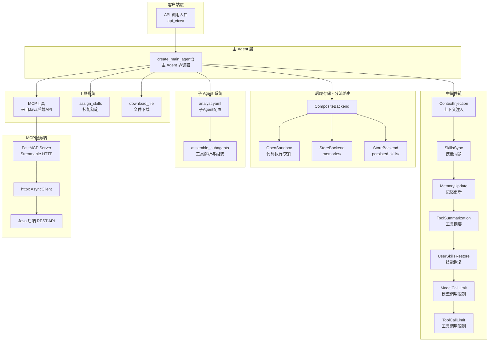
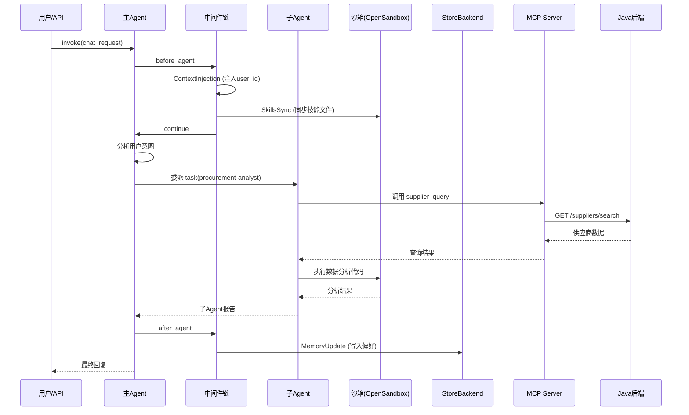

# DeepAgentsDemo2 项目架构文档

## 一、项目概述

本项目是一个基于 **LangGraph + DeepAgents 框架** 构建的智能 Agent 系统，主要用于**采购业务场景**。核心架构采用 **"主 Agent + 子 Agent 委派"** 模式，通过 MCP 协议对接后端业务 API，使用 OpenSandbox 沙箱执行代码，并以中间件机制实现可插拔的功能扩展。

### 技术栈

| 层级 | 技术 |
|------|------|
| Agent 框架 | deepagents (基于 LangGraph) |
| LLM | DeepSeek (ChatOpenAI 兼容) |
| MCP Server | FastMCP |
| 沙箱 | OpenSandbox (sdk-python) |
| HTTP 代理 | httpx (AsyncClient) |
| 数据存储 | InMemoryStore + MongoDB Checkpoint |
| 子 Agent 配置 | YAML |

---

## 二、整体架构图



---

## 三、目录结构与模块职责

```
project/
├── docs/
│   ├── agent-context-guide.md     # state/runtime 上下文概念指南
│   └── project-architecture.md    # 本文档
├── src/
│   ├── agent/                     # [核心] Agent 构建与配置
│   │   ├── main_agent.py          # ★ 主入口 - create_main_agent()
│   │   ├── config.py              # 路径常量/Store/Checkpoint 配置
│   │   ├── llm_config.py          # LLM 模型实例化 (DeepSeek)
│   │   ├── env_utils.py           # 环境变量加载 (.env → os.environ)
│   │   ├── schema.py              # 数据结构定义
│   │   ├── context_injection.py   # 运行时上下文注入 (入口)
│   │   ├── middleware_config.py   # 子Agent中间件工厂 (空)
│   │   ├── mcp_tools_bean.py      # 采购业务数据模型 (Pydantic)
│   │   ├── backends/              # 沙箱后端实现
│   │   │   ├── custom_opensandbox.py  # OpenSandboxBackend 封装
│   │   │   └── sandbox_setup.py       # 沙箱初始化/文件播种
│   │   ├── memoy/                 # 记忆与提示词
│   │   │   ├── AGENTS.md          # Agent 行为准则 (空)
│   │   │   └── prompts.py         # system_prompt 定义
│   │   ├── middlewares/           # 中间件集合
│   │   │   ├── context_injection.py   # 用户信息 → SystemMessage
│   │   │   ├── memory_update.py       # 自动提取关键词更新偏好
│   │   │   ├── skills_sync.py         # 本地技能 ↔ 沙箱同步
│   │   │   ├── tools_sunnarization.py # 上下文摘要/压缩
│   │   │   └── user_skills_restore.py # StoreBackend → 沙箱恢复 (预留)
│   │   ├── subagents/             # 子 Agent 管理
│   │   │   ├── read_yaml.py       # YAML解析 + assemble_subagents
│   │   │   └── agents/
│   │   │       └── analyst.yaml   # 子Agent配置模板
│   │   └── tools/                 # Agent 工具
│   │       ├── assign_skills.py   # 技能绑定工具 (空)
│   │       ├── MCP_client.py      # MCP 工具客户端
│   │       └── __init__.py
│   ├── api_view/                  # API 视图层 (空)
│   ├── mcp_server/                # MCP 服务端
│   │   ├── server_main.py         # FastMCP 入口
│   │   ├── server_config.py       # 服务端配置
│   │   ├── http_base.py           # lifespan 管理 (httpx 生命周期)
│   │   └── tools/
│   │       └── suppliers_tools.py # 供应商查询工具
│   ├── test/                      # 测试 (空)
│   └── unitl_tools/               # 公共工具
│       └── logger.py              # 统一日志配置
└── extensions.txt                 # VS Code 扩展推荐
```

---

## 四、核心模块详解

### 4.1 主 Agent 构建流程 (`main_agent.py`)

`create_main_agent()` 是整个系统的核心工厂函数，执行完整的 9 步初始化流程：

```
┌─────────────────────────────────────────────────────┐
│  1. 创建沙箱 (setup_sandbox)                        │
│     ├── 重连已有沙箱 或 新建沙箱                     │
│     ├── 播种 skills 文件到沙箱                       │
│     └── 创建 Python venv + 安装依赖                  │
├─────────────────────────────────────────────────────┤
│  2. 上传 AGENTS.md 到沙箱                           │
├─────────────────────────────────────────────────────┤
│  3. CompositeBackend 分流                           │
│     ├── /memories/       → StoreBackend (按user隔离)│
│     ├── /persisted-skills/ → StoreBackend (技能持久) │
│     └── 其他路径          → OpenSandbox             │
├─────────────────────────────────────────────────────┤
│  4. MCP 工具加载 (load_mcp_tools)                   │
├─────────────────────────────────────────────────────┤
│  5. 技能管理工具创建 (assign_skills + download)      │
├─────────────────────────────────────────────────────┤
│  6. 工具池构建 → available_tools                    │
├─────────────────────────────────────────────────────┤
│  7. 子 Agent YAML 加载 + 工具解析 (assemble)        │
├─────────────────────────────────────────────────────┤
│  8. 主Agent中间件链组装                              │
├─────────────────────────────────────────────────────┤
│  9. create_deep_agent() 创建主Agent                 │
└─────────────────────────────────────────────────────┘
```

### 4.2 后端分流架构 (CompositeBackend)

```python
# 三路分流设计
CompositeBackend(
    default=sandbox_backend,           # 沙箱：临时文件、代码执行
    routes={
        "memories": StoreBackend(      # 用户偏好持久化
            namespace=lambda rt: (user_id,)
        ),
        "persisted-skills": StoreBackend(  # 技能持久化
            namespace=SKILLS_STORE_NAMESPACE
        ),
    }
)
```

| 路由 | 后端 | 用途 |
|------|------|------|
| `default` | OpenSandbox | 代码执行、临时文件、AGENTS.md |
| `memories/` | StoreBackend | 按 user_id 隔离的用户偏好 |
| `persisted-skills/` | StoreBackend | 全局持久化技能 |

### 4.3 上下文五层模型

项目遵循 DeepAgents 框架的五层上下文体系（详见 `docs/agent-context-guide.md`）：

| 层次 | 载体 | 生命周期 | 本项目中体现 |
|------|------|----------|-------------|
| 输入上下文 | `state` 初始化 | 单次调用 | system_prompt, skills, memories |
| 运行时上下文 | `runtime.context` | 单次调用 | user_id, username (ProcurementContext) |
| 上下文压缩 | `state` 内部 | 自动触发 | SummarizationMiddleware (tools_sunnarization.py) |
| 上下文隔离 | 子Agent独立 state/runtime | 子Agent生命周期 | subagents 独立运行 |
| 长期记忆 | `runtime.store` | 跨会话持久 | StoreBackend → /memories/ |

### 4.4 中间件链

中间件按顺序在 Agent 生命周期中执行：

| 序号 | 中间件 | 类型 | Hook | 功能 |
|------|--------|------|------|------|
| 1 | ContextInjectionMiddleware | 自定义 | `before_agent` | 将 user_id/username 注入 SystemMessage |
| 2 | SkillsSyncMiddleware | 自定义 | `before_agent` | 本地技能文件 → 沙箱同步，有变更通知 |
| 3 | MemoryUpdateMiddleware | 自定义 | `aafter_agent` | LLM 提取关键词，自动更新用户偏好 |
| 4 | ModelCallLimitMiddleware | 框架内置 | - | 限制模型调用 ≤50 次 |
| 5 | ToolCallLimitMiddleware | 框架内置 | - | 限制工具调用 ≤200 次 |

### 4.5 子 Agent 系统

**配置驱动**：子 Agent 通过 YAML 文件定义，由 `read_yaml.py` 解析：

```yaml
# analyst.yaml 示例
name: analyst
description: 子智能体描述
tools:
  - tool1
  - tool2
system_prompts: 子智能体 system prompt
skills:
  - skill地址
```

**工具解析流程**：

```
YAML 文件 → load_yaml() → assemble_subagents()
                              ↓
                    resolve_tools(subagent, tool_map)
                              ↓
               ┌──────────────┴──────────────┐
               │ group 前缀匹配               │
               │ (name.startswith("group_"))  │
               │                              │
               │ include 名称匹配             │
               │ (name in tool_map)           │
               └──────────────────────────────┘
                              ↓
                    子Agent 配置 + 工具实例
```

### 4.6 MCP 工具系统

**两层架构**：

```
Agent 层 (MCP Client)              MCP 服务层 (MCP Server)
┌─────────────────────┐           ┌──────────────────────┐
│ MultiServerMCPClient│──streamable-http──→│ FastMCP Server       │
│                     │           │ ├── supplier_query     │
│ load_mcp_tools()    │           │ └── (可扩展更多工具)   │
│ → tool_map{name:tool}│          │                      │
└─────────────────────┘           │ httpx AsyncClient     │
                                  └──────┬───────────────┘
                                         │ HTTP REST
                                  ┌──────▼───────────────┐
                                  │ Java 后端 API         │
                                  │ /suppliers/search     │
                                  │ /parts/...            │
                                  │ /orders/...           │
                                  └──────────────────────┘
```

- **MCP Client** (`MCP_client.py`)：使用 `langchain_mcp_adapters` 连接 MCP Server，获取工具
- **MCP Server** (`server_main.py`)：FastMCP 封装，通过 `httpx` 转发到 Java 后端
- **lifespan 管理** (`http_base.py`)：用 `asynccontextmanager` 管理 HTTP 连接池生命周期

### 4.7 数据模型 (`schema.py`)

| 模型 | 用途 |
|------|------|
| `ProcurementContext` | 运行时用户上下文 (user_id, username) |
| `UserPreferences` | 用户偏好 (输出格式/货币/最近查询) |
| `ChatRequest/Response` | 聊天请求/响应 |
| `Message` | 消息模型 (含工具调用信息) |
| `Session` | 会话历史管理 |
| `Stream*Event` | SSE 流式事件模型 |

### 4.8 记忆更新机制 (`memory_update.py`)

```
Agent 回复完成 (aafter_agent)
  ↓
获取 user_id
  ↓
判断最后一条用户消息是否"有意义"
  ├── 跳过：打招呼、无意义消息
  ├── 检测：关键词匹配 + 子Agent委派
  └── 有意义 → LLM 提取实体
       ↓
  _extract_entities(model, user_msg, ai_summary)
       ↓
  返回: {suppliers: [...], query: "..."}
       ↓
  写入 /memories/{user_id}/preferences.md
```

---

## 五、数据流全景



---

## 六、配置与依赖

### 环境变量 (`.env`)

| 变量 | 用途 |
|------|------|
| `DEEPSEEKAPI` | DeepSeek API Key |
| `DEEPSEEKURL` | DeepSeek API 地址 |
| `DEEPSEEKMODEL` | 主模型 (如 deepseek-chat) |
| `DEEPSEEKMODELFAST` | 快速模型 (摘要用) |
| `APP_ENV` | 运行环境 (development/production) |

### 外部服务

| 服务 | 地址 | 用途 |
|------|------|------|
| Java 后端 API | `http://127.0.0.1:8000` | 采购业务数据 |
| MCP Server | `http://127.0.0.1:8000/mcp` | Streamable HTTP |
| OpenSandbox | `api.opensandbox.io` | 代码执行沙箱 |
| MongoDB | (配置在 config.py) | Checkpoint 持久化 |

---

## 七、设计模式总结

| 模式 | 体现 |
|------|------|
| **工厂模式** | `create_main_agent()` 工厂函数，每次调用创建全新实例 |
| **中间件/管道模式** | Agent 生命周期钩子链 (before/after_agent) |
| **委派模式** | 主Agent 将任务委派给子Agent (task 工具) |
| **策略模式** | CompositeBackend 按路径分流到不同后端 |
| **适配器模式** | OpenSandboxBackend 封装 SandboxSync → BaseSandbox 协议 |
| **配置驱动** | 子Agent 通过 YAML 声明式定义 |
| **lifespan 模式** | FastMCP 的 lifespan 管理 HTTP 连接池 |

---

## 八、待完善项

1. **`middleware_config.py`** — 子Agent中间件工厂方法目前为空    /已处理
2. **`tools/assign_skills.py`** — 技能绑定工具未实现            /
3. **`AGENTS.md`** — Agent 行为准则文件内容为空
4. **`memoy/`** 目录拼写应为 `memory/`（当前为 `memoy`）
5. **`api_view/`** — API 视图层待实现
6. **`test/`** — 测试模块待补充
7. **`user_skills_restore.py`** — 技能恢复中间件仅有注释
8. **持久化存储** — `STORE` 当前使用 `InMemoryStore`（重启丢失），建议迁至持久化方案
9. **`checkpointer`** — 当前 MongoDB 连接变量未在 `config.py` 中显式定义
